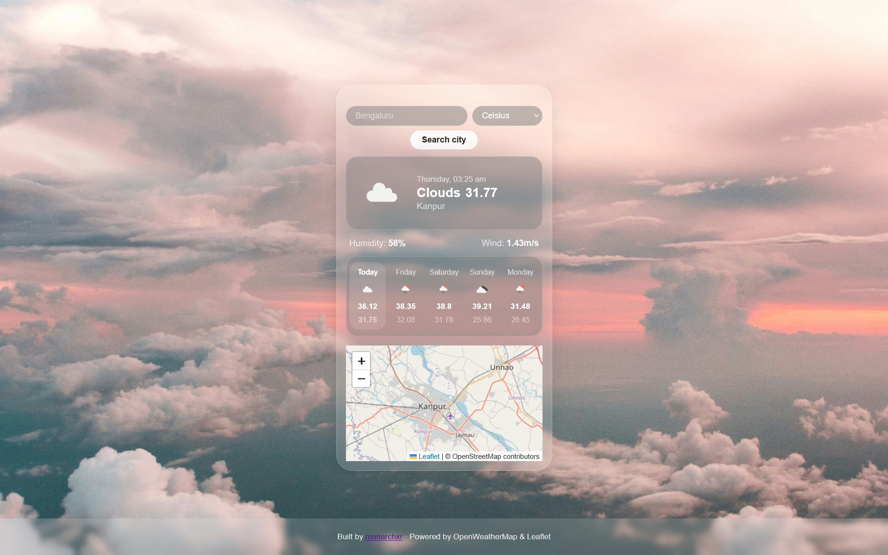
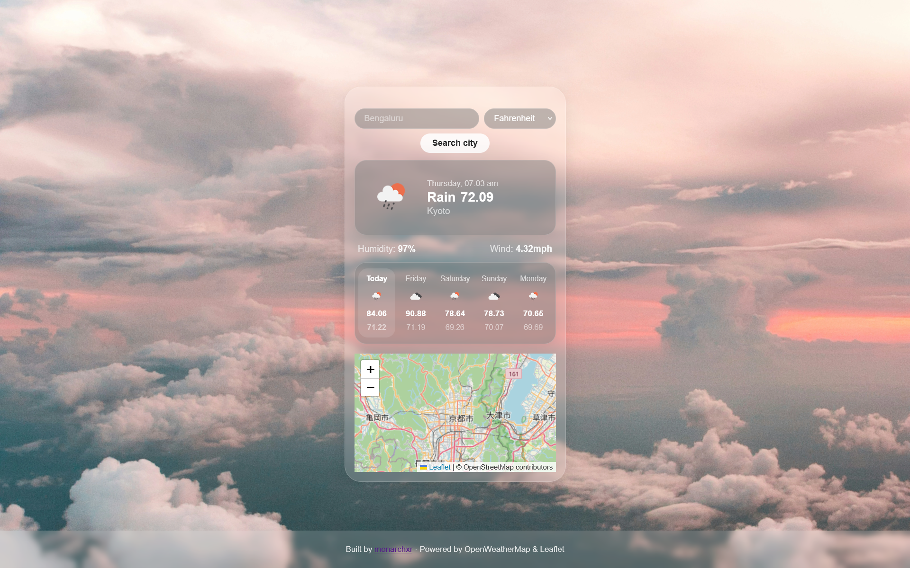

# Weather Dashboard

A clean, minimal weather app built with vanilla HTML, CSS, and JavaScript. Search any city and get current conditions, a 5-day forecast, and an interactive map, all in one card.

## Screenshots

## Features

- Current weather — temperature, conditions, humidity, wind speed
- Local time for the searched city, not your machine's time
- 5-day forecast with daily high/low and weather icons
- Interactive map that pans to the searched city
- Celsius, Fahrenheit, and Kelvin support

## Built With

- HTML / CSS / JavaScript — no frameworks
- [OpenWeatherMap API](https://openweathermap.org/api) — weather data
- [Leaflet.js](https://leafletjs.com) — interactive map

## Setup

1. Clone the repo
2. Get a free API key from [OpenWeatherMap](https://openweathermap.org/api)
3. Open `scripts.js` and paste your key into `const key = ""`
4. Open `index.html` in your browser — no build step needed